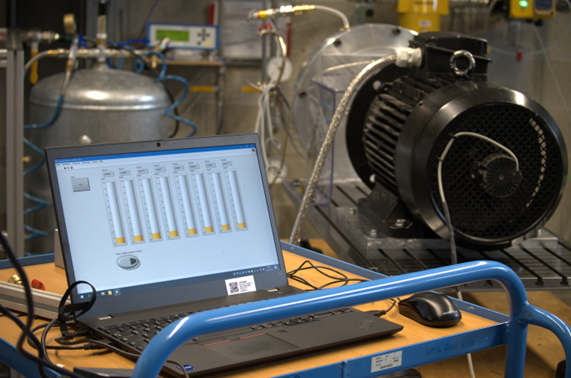
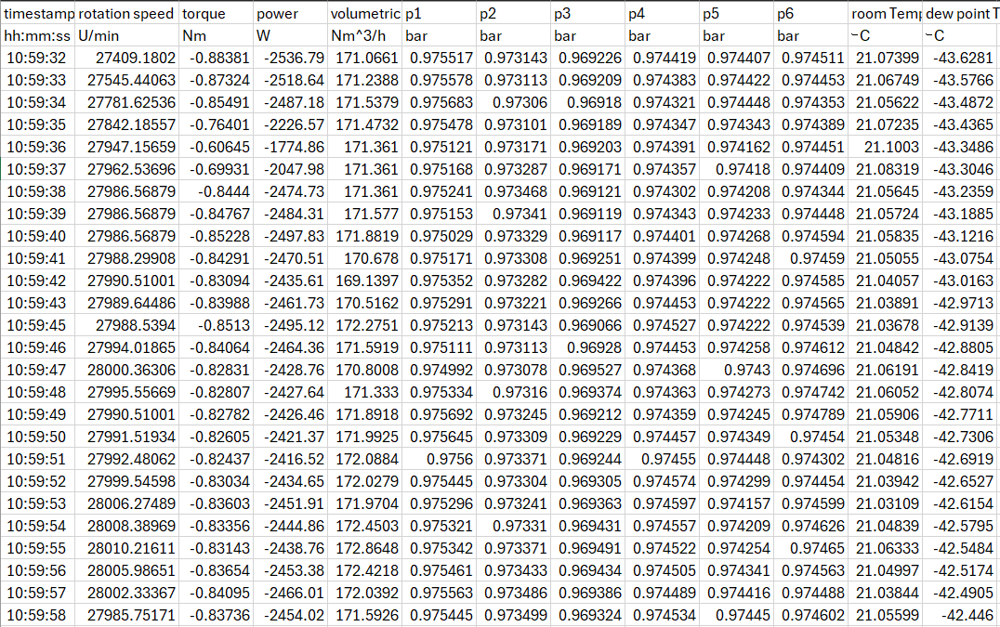
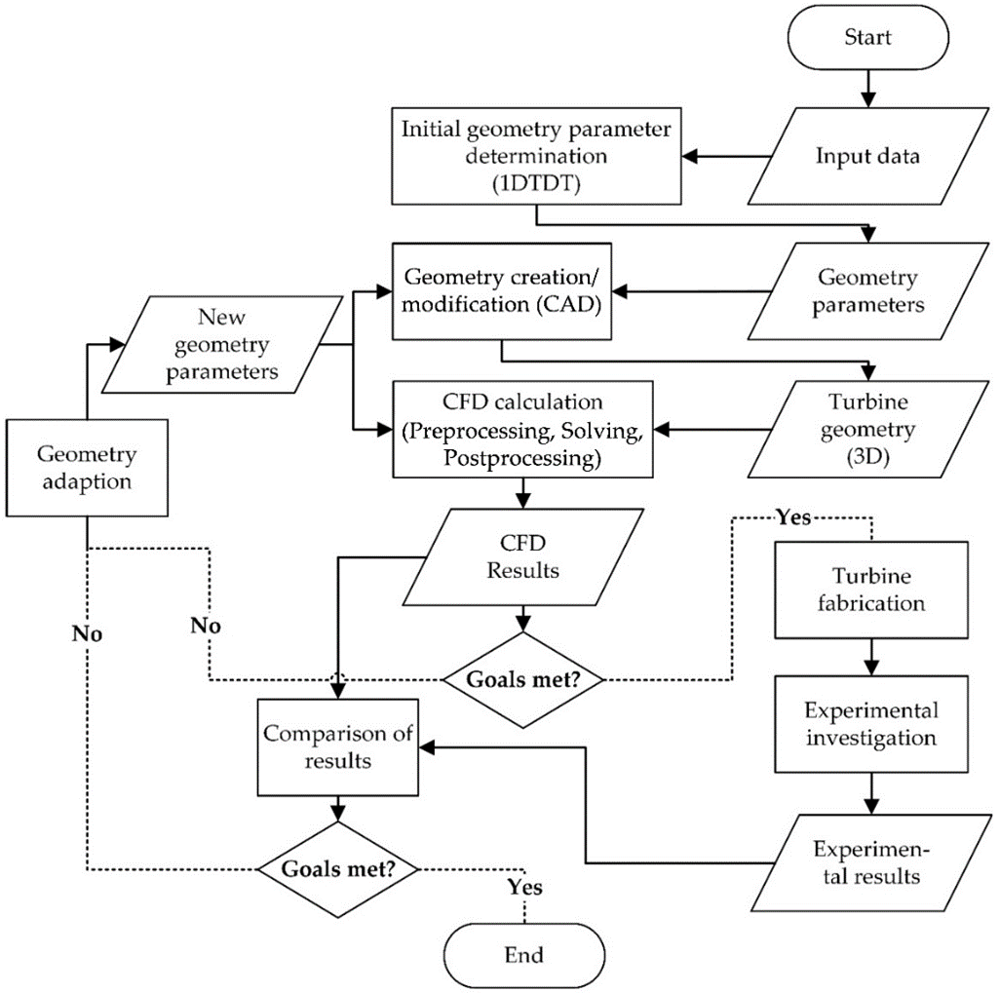
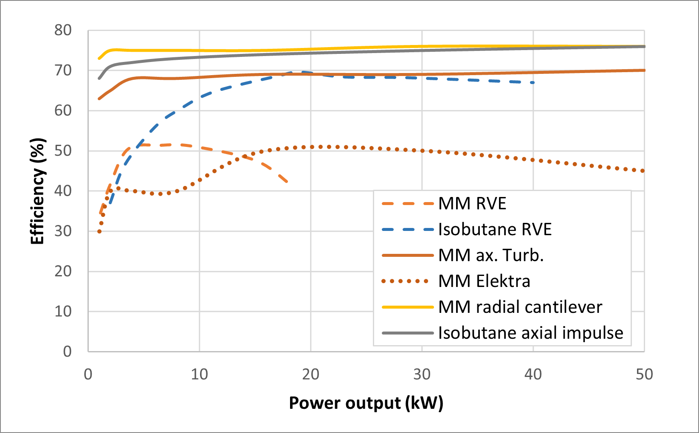
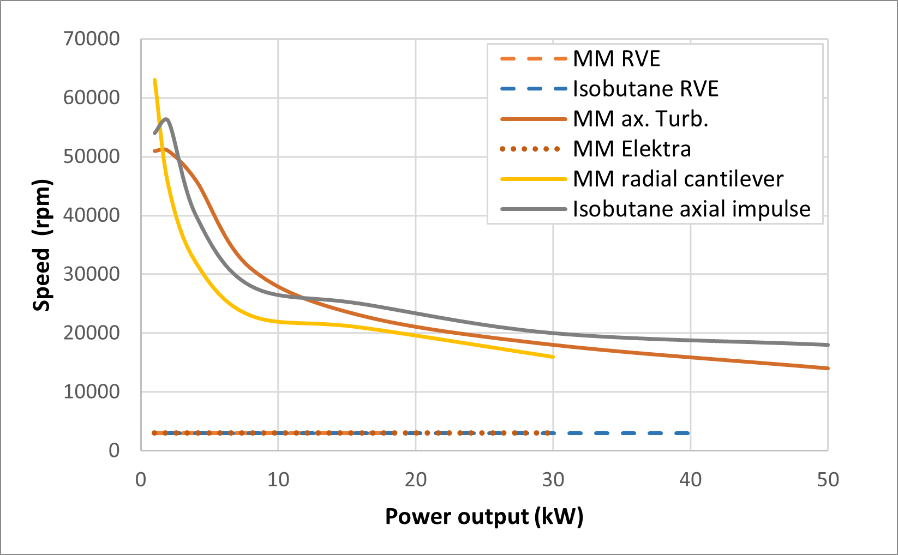
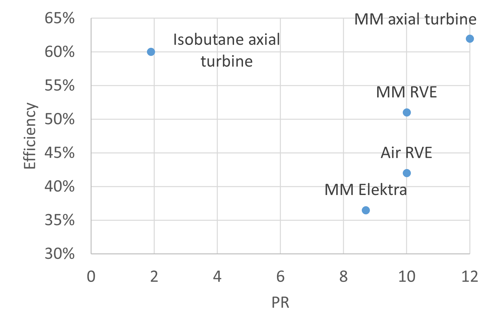
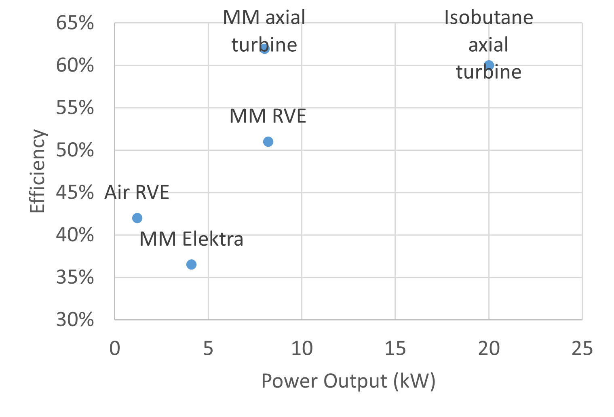
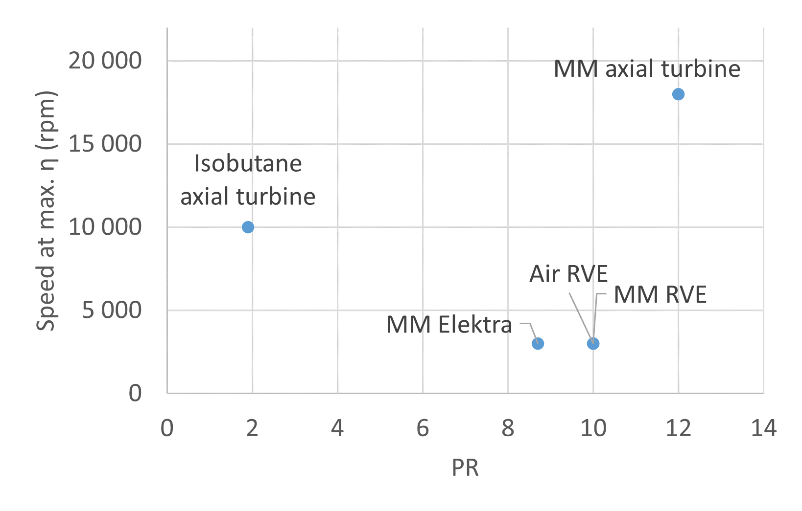
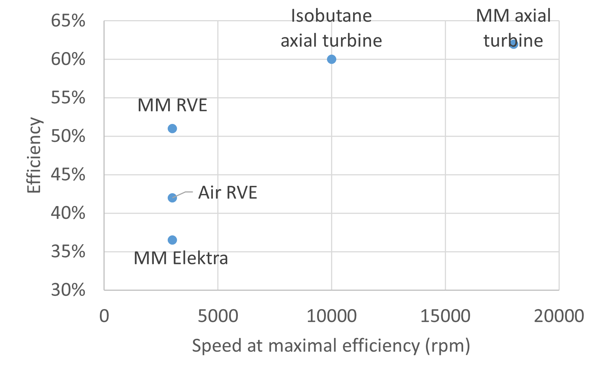
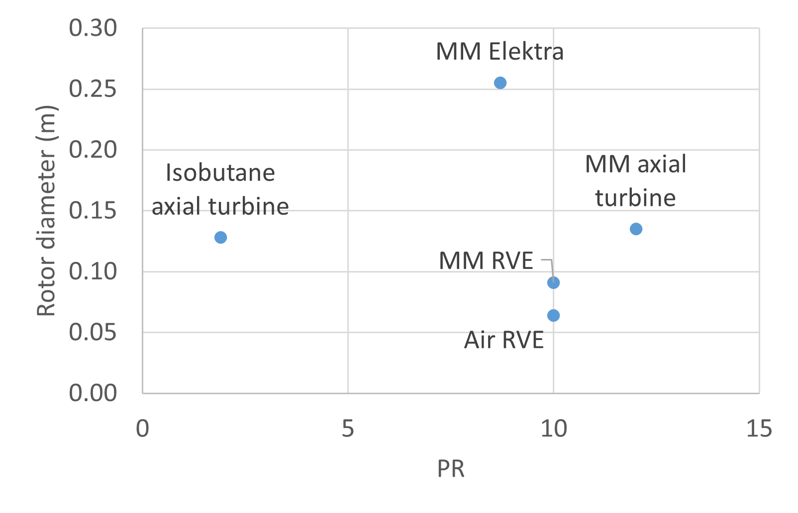

# DEXPAND 
Optimised expanders for small-scale distributed energy systems - raw experimental data, expander design tools, expander geometries, performance mapping.

> DEXPAND project analyses potentials and feasibility of prospective expanders for organic Rankine cycles (ORC) based on impulse turbomachines and rotary vane expanders in power range of 1-50 kW. Geometries and experimental data including many off-design operation states are summarised and published to boost industrial development as well as research on expanders in this field. 

This is a publc repository of the research project where expander geometries, experimental data and performance mapping will be published. The repository is open to the public and is intended to be used by the research community, industry and other stakeholders interested in the field of small-scale distributed energy systems and expanders for ORC.

## Table of contents

- [DEXPAND](#dexpand)
  - [Table of contents](#table-of-contents)
  - [Expander geometries](#expander-geometries)
  - [Experimental data](#experimental-data)
  - [Design tools](#design-tools)
  - [Performance mapping](#performance-mapping)
  - [Links](#links)
- [Licensing](#licensing)

## Expander geometries
Folder `geometries` contains CAD models (and/or drawings) of expanders used in the project. The models are available in various formats, including STEP, STL and native CAD formats. The models are intended to be used for further research and development of expanders for small-scale distributed energy systems.

## Experimental data
Folder `experimental_data` contains raw experimental data from the tests of expanders. The data are available in various formats, including CSV, XLSX and other formats. The data are published to boost industrial development as well as research on expanders in this field. Each subfolder contains data from a specific test, including the test conditions, measured data and other relevant information.

## Design tools
This folder contains various codes, scripts and tools used for the design of the ORC expanders as well as for the analysis of the experimental data, and prediction of the off-design performance. The tools are available in various formats, including Python, MATLAB, Excel and other formats. 

## Performance mapping
A dedicated folder `performance_mapping` contains detailed reports and results of the performance mapping of the expanders. The reports include the efficiency mapping, speed mapping, power output mapping, cost mapping and other relevant information. The results are intended to be used for further research and development of expanders for small-scale distributed energy systems.

The first result belonging to the feasibility mapping is the cycle design point optimization from WP1, repeated below in *Figure 1*. With a tailor-made design of the expander, it was how the design nominal point of the expander and whole cycle can affect the operational efficiency and thus cumulative power production. In this specific case a potential for 10 % increase in accumulated power production was demonstrated. 

*Figure 1* Energy efficiency and accumulated power output for the original and optimized designs based on the reference case study.

As a next phase, feasibility of expanders was looked at in detail using the developed models and experience from our experimental development. These results are shown in *Figure 2* and can betaken as indicative results based on the models informed by engineering limits taken from our experimental experience. The efficiency values are indicative and detailed design may shift them by several (typically no more than 2) percentage points, in case of optimization works also into higher efficiency.

Note that for presented expanders there are several groups of boundary conditions and thus corresponding thermodynamic cycles. All MM expander results correspond to the CTU 120 kWth system design. Isobutane turbines are designed around low PR case of 400/160 kPa of the Expand isobutane test rig. RVE for isobutane at these conditions is, however, not feasible, as it would be prohibitively large and operation at higher pressures and slightly higher pressure ratio (1210/350 kPa) is used. Extensive experience from the RVE experimental design suggest unfeasible operation at expander length above 300 mm (largest RVE we built has 245 mm). 

Together with a L/D parameter maximal value at 2.5, i.e. stator diameter 120 mm, the results for RVE cannot be extended all the way to the 50 kW and entirely different approach to mechanical design would need to be developed for higher power outputs. RVE and Elektra turbine are considered always operating at 3000 rpm.
The RVE results show that there is a cap of efficiency, clearly depending on the pressure ratio (or even more expansion ratio) with higher values and lower pressure ratios, as well as size. Better pressure ratio and densities for the isobutane parameters result in significantly higher peak efficiency and larger maximal power output. Advantageous for the isobutane RVE efficiency are also relatively smaller leakages per unit of produced power.

However, high-speed turbines, unless we want to exceed extreme speeds, the efficiency drops significantly at small power output systems. The Elektra turbine comes out of our analysis as a possible techno-economic competitor of RVE at power output above about 10 kW. Despite mostly slightly lower efficiency, it enables dry operation and limits a servicing need, which the RVEs have after no more than 10 000 hours.

*Figure 2 *Efficiency mapping for considered expander types (assuming impulse turbines).

Nominal design speed needs to be also considered when selecting the expanders. *Figure 3* shows, that while the RVE and Elektra are considered always at constant 3 000 rpm, the other turbines are not only operating at high speed, but a suitable speed differs largely based on the power output.
 

*Figure 3* Expander mapping regarding speed for considered expander types.

Highly important are however feasibility maps from the experimental data. An overview of performance at nominal (or maximal if nominal parameters were not achieved) regarding the PR, power output and efficiency is in *Figure 4*. Note for the further results the low PR and highest power output of the isobutane turbine. This makes the high PR axial turbines performance way more challenging when these two turbines are compared against each other. The axial turbines achieve the highest efficiency, while for the Elektra turbine should be mentioned that this is the first reported ORC trial of this type of turbine and there is a space for improvement, while previous results suggested that it might have the most competitive performance at higher power outputs than used here. 

  

*Figure 4* Performance maps of the experimentally explored expanders regarding the PR, power output and efficiency.

Clear disadvantage of the axial turbines is the necessary high speed, documented then in *Figure 5*. This is particularly represented in achieved performance, where both axial turbines reached only below-nominal speeds. This was 10 000 rpm for the isobutane turbine (nominal 17 – 20 000 rpm) while the MM turbine during the ORC operation did was for safety reasons due to vibrations operated below 20 000 rpm (nominal 28 000 rpm). This prompted a modified design of a 18 000 rpm axial isobutane turbine operating also at higher mass flowrate at slightly lower PR, as shown on the first graph. The document version on the repository will be updated once the experimental performance is obtained. 

    

*Figure 5*. Performance maps of the experimentally explored expanders regarding the PR, nominal speed and efficiency.

In order to complement the technical parameter of speed, *Figure 6* shows the rotor diameters of the turbines (eventually stator bore diameter for RVE) for the explored expanders. As expected, diameter must increase, rotational speed decrease with power rating. Furthermore, efficiency increases also with power rating. This effect is most probably underestimated, because the modelling tool does not take into account:
- Reynolds number dependency of friction losses
- Gaps and the corresponding (tip) leakage losses
- Trailing edge thickness and trailing edge losses
All these issues are getting worse if reducing power rating (= smaller turbine). In particular, if partial admission Is necessary (1 kW, 2 kW).

*Figure 6* Parameter map of the experimentally explored expanders regarding the PR and rotor (or stator bore for RVE diameter).

As a final result of the mapping are the economic parameters, specifically cost per kW of power output plotted against the efficiency in *Figure 7*. There are several specific points to take into account. The air RVE has a high cost due to being only 1 kW unit. Yet, isobutane axial turbine with external manufacturing has still higher unit cost even though having the highest power output, reason why the in-house procured manufacturing and in-house assembly has much lower cost. Lastly, the MM Elektra turbine is somewhat costly as a result of currently limited efficiency and thus low power output.

*Figure 7* Performance maps of the experimentally explored expanders regarding the PR, nominal speed and efficiency.

The full project technical report is available in `reports` folder as well as a subreport for the performance mapping of the turboexpanders is available in the same folder.

## Links

- [Project homepage](https://dexpand.cz/en/)
- [Funding agency - Technology Agency of the Czech Republic](https://www.tacr.cz/en/)

# Licensing

This repository is linsenced under the MIT License. See the [LICENSE](LICENSE) file for details.

> The research leading to these results has received funding from the EEA / Norway Grants and the Technology Agency of the Czech Republic within the KAPPA Programme. The Project „Optimised expanders for small-scale distributed energy systems“ benefits from a € 1,469,700 grant from Iceland, Liechtenstein and Norway through the EEA Grants and the Technology Agency of the Czech Republic.
